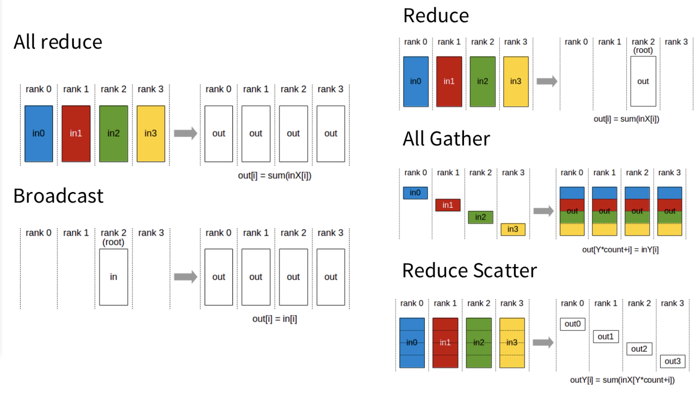

# 这个folder干什么

本目录用于白盒理解分布式训练中的基础通信原语（collective communication）  
所有后续的 Data Parallel（DP）、Tensor Parallel（TP）以及 FSDP / ZeRO，本质上都由这些通信操作组合而成。  

## 限制是什么  

本目录 仅支持 GPU + NCCL
假设运行环境为单机多 GPU
所有示例均在 CUDA device 上运行

## 这个目录包含的通信原语  

| 文件                  | Collective     | 通信语义         | 典型用途         |
| ------------------- | -------------- | ------------ | ------------ |
| `broadcast.py`      | broadcast      | 1 → N        | 参数初始化        |
| `reduce.py`         | reduce         | N → 1        | 统计 / 汇总      |
| `all_reduce.py`     | all_reduce     | N → N（求和/平均） | DP 梯度同步      |
| `all_gather.py`     | all_gather     | N → N（拼接）    | TP 前向        |
| `reduce_scatter.py` | reduce_scatter | N → N（分片）    | TP 反向 / FSDP |




### 1. broadcast 全部同步 启动步骤


```bash
#第一次运行的时候跑
export NCCL_DEBUG=INFO
export NCCL_DEBUG_SUBSYS=INIT,GRAPH,COLL
# 第二次只需要这个就行
export NCCL_DEBUG=WARN

```

运行script
```bash
CUDA_VISIBLE_DEVICES=0,1 python collectives/broadcast.py

[rank 0] after  broadcast: tensor([42., 42., 42., 42.], device='cuda:0')
[rank 1] after  broadcast: tensor([42., 42., 42., 42.], device='cuda:1')
```

### 2. reduce 全部加到某一个gpu上

script to run
```bash
CUDA_VISIBLE_DEVICES=0,1 uv run python collectives/reduce.py
```


```bash
[rank 0] before reduce: tensor([1.], device='cuda:0')
[rank 1] before reduce: tensor([2.], device='cuda:1')

[rank 0] after  reduce: tensor([3.], device='cuda:0')
[rank 1] after  reduce: tensor([2.], device='cuda:1')

```

### 3. all_reduce N → N（求和/平均）

all_reduce = reduce + broadcast  

- 先聚合  
- 再复制  

每个 rank 最终都有一样的结果

- shape 不变
- 数据被覆盖


```bash
# 运行
CUDA_VISIBLE_DEVICES=0,1 uv run python collectives/all_reduce.py
```

```bash
# 结果
[rank 0] before all_reduce: tensor([1.], device='cuda:0')
[rank 1] before all_reduce: tensor([2.], device='cuda:1')

[rank 0] after  all_reduce: tensor([3.], device='cuda:0')
[rank 1] after  all_reduce: tensor([3.], device='cuda:1')
```
### 4. all gather N → N（拼接）

运行script
```bash
# 运行
CUDA_VISIBLE_DEVICES=0,1 uv run python collectives/all_gather.py
```

```bash
[rank 0] before all_gather: x = tensor([1.], device='cuda:0')
NCCL version 2.27.5+cuda12.9
[rank 1] before all_gather: x = tensor([2.], device='cuda:1')
[rank 1] after  all_gather: out = [tensor([1.], device='cuda:1'), tensor([2.], device='cuda:1')]
[rank 0] after  all_gather: out = [tensor([1.], device='cuda:0'), tensor([2.], device='cuda:0')]
```

### 5. reduce_scatter N → N（分片）

```bash
[rank 1] before reduce_scatter: x = tensor([3., 4.], device='cuda:1')
[rank 0] before reduce_scatter: x = tensor([1., 2.], device='cuda:0')
NCCL version 2.27.5+cuda12.9
[rank 0] after  reduce_scatter: out = tensor([4.], device='cuda:0')
[rank 1] after  reduce_scatter: out = tensor([6.], device='cuda:1')
```